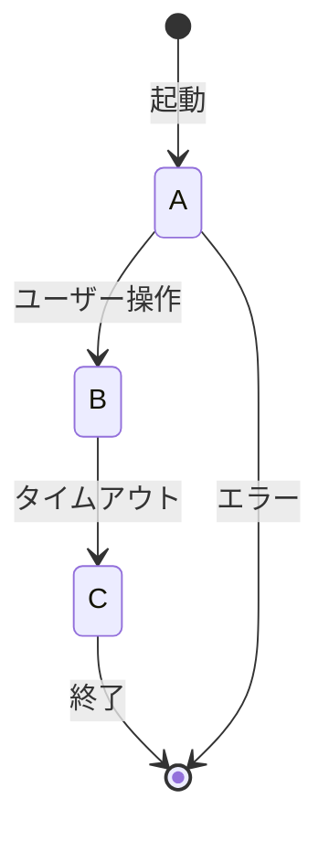

(ここに出力)
"""
# ソフトウェアテスト総合ガイド

## 1. ソフトウェアテストの基礎

### 1.1 テストとは何か？
ソフトウェアテストは、**ソフトウェアの品質を評価し、欠陥を発見する活動**です。  
これにより、ソフトウェアが要件を満たし、ユーザーの期待に応えることを確認し、開発プロセス全体の品質を担保します。

### 1.2 なぜテストが必要か？
- **品質向上**: 欠陥を早期に発見・修正することで、製品やサービスの品質を向上させます。  
- **リスク軽減**: 重大な不具合がリリース後に発覚するリスクを下げ、社会的信用を守ります。  
- **要件適合性の確認**: ソフトウェアが仕様や規制に適合しているか検証し、顧客やユーザーの要求に応えられることを保証します。

---

## 2. JSTQBが提唱するテストの基本概念

### 2.1 テストの7原則
JSTQB（ISTQBの日本版）では、以下の7原則が「なぜテストが大事か」「テストの落とし穴は何か」を示しています。

1. **テストは欠陥の存在を示すが、欠陥の不在は証明できない**  
   テストでバグが見つからなくても、バグが存在しないと断言はできません。

2. **全数テストは不可能**  
   入力や機能の組み合わせは膨大であり、すべてをテストすることは現実的に困難です。  
   リスクに基づいてどこを重点的にテストするかを決める必要があります。

3. **早期テストの重要性**  
   ソフトウェア開発の初期段階からテストを行うことで、欠陥を早期に発見・修正しやすくなります。

4. **欠陥の偏在**  
   不具合は特定のモジュールや機能に集中しやすい傾向があります。  
   過去のバグ履歴をもとに重点的にテスト範囲を定めることも有効です。

5. **殺虫剤のパラドックス**  
   同じテストを繰り返すと、新しい欠陥が見つかりにくくなるため、テストケースの定期的な見直しが必要です。

6. **テストはコンテキスト依存**  
   製造業向けソフトウェア、Webサービス、医療機器ソフトなど、業種や規模に応じたテスト手法を選択する必要があります。

7. **バグゼロの誤謬**  
   欠陥をゼロにすることが最終目標ではなく、「ユーザーが必要とする品質」をどこまで高められるかが肝心です。

### 2.2 テストプロセス
1. **テスト計画**: 目的・範囲・アプローチ・リソース・スケジュールを策定  
2. **テストモニタリングとコントロール**: テスト進捗を監視し、必要に応じて計画を調整  
3. **テスト分析**: テスト対象領域を明確化（仕様やリスク分析など）  
4. **テスト設計**: テストケース、テストデータ、手順を作成  
5. **テスト実装**: テスト環境構築、テストスクリプト・自動化設定など  
6. **テスト実行**: テストを実行し、結果を評価・記録  
7. **テスト完了**: 結果の総括、レポート作成、テスト資産の保管

### 2.3 テストレベル
- **単体テスト（コンポーネントテスト）**: 個々の関数やモジュールレベル  
- **結合テスト**: 複数モジュールの連携動作  
- **システムテスト**: システム全体が要件通りかの検証  
- **受け入れテスト**: ユーザーや顧客の要件・ニーズを満たしているか最終確認  

---

## 3. テスト技法

### 3.1 ブラックボックステスト技法
- **同値分割**: 入力データを意味的に同じグループに分け、代表値をテスト  
- **境界値分析**: 入力の境界（閾値）付近を重点的にテスト  
- **決定表テスト（ディシジョンテーブルテスト）**: 複数条件×結果を表形式で整理し、全組み合わせを網羅  
- **状態遷移テスト**: システムが複数の「状態」を持ち、それが入力イベントによってどう変化するかを検証

### 3.2 ホワイトボックステスト技法
- **ステートメントカバレッジ (C0)**: すべての命令文が最低1回は実行されること  
- **ブランチカバレッジ (C1)**: `if`等の分岐の真偽両方を最低1回ずつ実行  
- **条件/分岐網羅 (C2)**: 各条件の組み合わせを網羅  

---

## 4. テスト設計手法とカバレッジ

### 4.1 同値クラス分割
入力が広範な場合、同じ振る舞いをするとみなせるクラス単位にまとめ、各クラスから代表値のみテストして効率化。

| 入力範囲     | 同値クラス              | 代表値 |
|--------------|-------------------------|--------|
| 0〜10        | 有効な入力              | 5      |
| -∞〜-1       | 無効な入力（負の数）    | -5     |
| 11〜∞        | 無効な入力（範囲外）    | 15     |

### 4.2 境界値分析
バグが発生しやすい境界（0、最大値、最小値±1など）周辺を重点的にテストし、致命的なエラーを発見しやすくする。

| 入力範囲  | 境界値       | テスト対象値 |
|-----------|--------------|--------------|
| 0〜10     | 境界値下限   | -1, 0, 1     |
|           | 境界値上限   | 9, 10, 11    |


### 4.3 ディシジョンテーブルテスト
複数の条件×結果を表で整理し、漏れなくチェック。複雑なビジネスロジックや割引計算、権限管理などで特に効果的。

以下は、あるシステムがユーザーの入力に応じて異なる出力を返す場合のディシジョンテーブル例です。

| 条件                     | 条件1: ログイン済 | 条件2: 管理者権限 | アクション | 結果       |
|--------------------------|-------------------|-------------------|-----------|------------|
| ユーザーがログインしており管理者である | ○                 | ○                 | 設定変更  | 許可       |
| ユーザーがログインしているが管理者でない | ○                 | ×                 | 設定変更  | 拒否       |
| ユーザーがログインしていない          | ×                 | ー                 | 設定変更  | 拒否       |

### 4.4 状態遷移テスト
システムが内部状態を持つ場合、すべての状態と遷移（イベント）を網羅するようテストケースを設計。



### 4.5 カバレッジ基準と活用

##### ステートメントカバレッジ (C0)
- **概要**: すべての命令文が少なくとも1回実行されることを保証。
- **例**: 次のコードを考えます。
  ```python
  def calculate(x):
      if x > 0:
          return x * 2
      return 0
- テストケース:
  1. x = 5 （条件 x > 0 を満たすパス）
  2. x = -5 （条件 x > 0 を満たさないパス）
- すべての命令（return x * 2 と return 0）が実行され、C0を満たします。

- テストケース:  
  1. x = 2 （x % 2 == 0 が真）
  2. x = 1 （x > 0 が真）
  3. x = -1 （どちらも偽）
- これにより、条件のすべてのパスが実行され、C1を満たします。

#### ブランチカバレッジ (C1)  
- **概要**: 条件式のすべての分岐（真偽）を網羅。
- **例**: 次のコードを考えます。

   ```python
   def is_even_or_positive(x):
      if x % 2 == 0 or x > 0:
         return True
      return False
   ```

- テストケース:
  1. x = 2 （x % 2 == 0 が真）
  2. x = 1 （x > 0 が真）
  3. x = -1 （どちらも偽）
- これにより、条件のすべてのパスが実行され、C1を満たします。

#### 条件/分岐網羅 (C2)
- **概要**: 条件式内のすべての部分条件が真偽両方を少なくとも1回ずつ網羅。
- **例**: 次のコードを考えます。

   ```python
   def is_valid(x, y):
      if (x > 0 and y < 10):
         return True
      return False
   ```
- テストケース:
  1. x = 1, y = 5 （x > 0 が真、y < 10 が真）
  2. x = -1, y = 5 （x > 0 が偽、y < 10 が真）
  3. x = 1, y = 15 （x > 0 が真、y < 10 が偽）
  4. x = -1, y = 15 （x > 0 が偽、y < 10 が偽）
- 各条件のすべての真偽を網羅し、C2を満たします。

---

## 5. Googleが提唱するテストサイズの概念

大規模開発組織では、テストを“サイズ”で区分し、目的や実行速度に応じて使い分けることが多いです。

1. **Small テスト**  
   - 1つのクラスや関数など、ごく小さな単位でのテスト  
   - 外部依存（DBアクセスやネットワークなど）はMock/Stubsで切り離す  
   - 実行が高速で、頻繁に走らせやすい（ユニットテストのイメージ）

2. **Medium テスト**  
   - 複数のクラスやモジュールが連携するが、まだシステム全体ではない程度  
   - DBやファイルI/Oなど一部本物のリソースを使うこともある  
   - Smallに比べると時間がかかるが、結合レベルの妥当性を確認できる

3. **Large テスト**  
   - システム全体を含むエンドツーエンドのテスト、実際の外部サービスや本番相当の環境を使用する場合も  
   - 実行時間が長く不安定要素が多い（ネットワーク遅延等）  
   - リリース前などに一定頻度で走らせ、システムの最終チェックを行う

**使い分けのポイント**  
- 開発中はSmallテストを高頻度で実行し、細かい不具合を素早く検出。  
- 機能がまとまったらMediumテストで結合不具合を発見。  
- リリース前や大きな変更のタイミングでLargeテストを実施し、全体品質を確認。

---

## 6. テストケース設計のヒント

1. **リスクベースアプローチ**  
   ユーザー影響が大きい機能や、バグ発生率が高い領域を優先的にテストする  

2. **境界値・異常値を重点的に**  
   「絶対に来ないはず」の値で意外とバグが見つかることが多い  

3. **シナリオテスト + 単体テストの併用**  
   システム全体を横断するユーザーフローと、細部をチェックするユニットテストを組み合わせる  

4. **テストの再利用性とメンテナンス性を意識**  
   テストコードを整理し、後から参入したメンバーでも理解しやすい構造を目指す  

---

## 7. テストとプロセスへの組込み

- **CI/CDとの連携**  
  GitHub ActionsやGitLab CIなどでプッシュ時に自動テストを実行。  
  Smallテスト（ユニットテスト）は毎回、Medium/ Largeテストは一定頻度やリリース前に実施。

- **カバレッジツール**  
  `pytest-cov`や`coverage.py`でカバレッジを可視化。  
  C1, C2の漏れを発見し、テスト追加の優先度を決める。

- **テスト駆動開発 (TDD)**  
  テストを先に書き、失敗を確認 → コードを書いてテストをパスさせる → リファクタリング。  
  品質が自然に高まり、設計が洗練されやすい。

---

## 8. 非機能テストの詳細

### 8.1 パフォーマンステスト
- **概要**: システムの応答時間、スループット、リソース使用率などを評価します。
- **手法**: ロードテスト、ストレステスト、スパイクテスト、持続性テストなど。
- **ツール例**: JMeter、Gatling、Locustなど。

### 8.2 セキュリティテスト
- **概要**: システムの脆弱性を発見し、セキュリティリスクを低減します。
- **手法**: ペネトレーションテスト、静的解析、動的解析など。
- **ツール例**: OWASP ZAP、Burp Suite、SonarQubeなど。

### 8.3 ユーザビリティテスト
- **概要**: ユーザーインターフェースの使いやすさやユーザー体験を評価します。
- **手法**: ユーザーインタビュー、観察、ヒューリスティック評価など。

### 8.4 可用性テスト
- **概要**: システムが必要なときに利用可能であることを確認します。
- **手法**: 障害シミュレーション、冗長性の確認など。

---

## 9. テストデータ管理

### 9.1 テストデータの生成
- **方法**: 実際のデータを使用する場合のプライバシー保護（データマスキング、匿名化）や、合成データの生成方法。
- **ツール例**: Faker、Mockarooなど。

### 9.2 テストデータの管理
- **戦略**: データの再利用性、バージョン管理、データセットの整合性維持。

---

## 10. テスト自動化のベストプラクティス

### 10.1 テストコードの品質管理
- **コードレビュー**: テストコードも通常のコードと同様にレビューを行い、品質を維持。
- **リファクタリング**: テストコードの可読性と保守性を高めるための定期的な見直し。

### 10.2 テスト自動化の設計パターン
- **ページオブジェクトパターン**（UIテストの場合）
- **データ駆動テスト**や**キーワード駆動テスト**

### 10.3 継続的インテグレーション（CI）との統合
- **詳細な設定**: テスト失敗時の通知方法、リトライ戦略など。
- **環境の一貫性**: テスト実行環境の統一（Dockerの活用など）。

---

## 11. テストメトリクスと評価

### 11.1 テストカバレッジ以外の指標
- **バグ検出率**: 発見されたバグの数や種類。
- **テスト実行時間**: テストスイートの実行にかかる時間。
- **テストの安定性**: フレークテスト（不安定なテスト）の割合。

### 11.2 継続的な評価と改善
- **定期的なレビュー**: テストプロセスやメトリクスの定期的な見直し。
- **改善アクションの実施**: メトリクスに基づいた具体的な改善策の実施。

---

## 12. アジャイルとの統合

### 12.1 アジャイルテストの概念
- **テスト駆動開発（TDD）**や**振る舞い駆動開発（BDD）**の詳細な導入方法。
- **スクラムやカンバンとの連携**: スプリント計画やデイリースクラムでのテスト活動の位置づけ。

### 12.2 継続的なフィードバックループ
- **テスト結果の迅速なフィードバック**: 開発者が即座に対応できる仕組み。
- **ユーザーからのフィードバックの取り込み**: ユーザーストーリーやエピックに基づいたテストケースの設計。

---

## 13. テストチームの構築と役割分担

### 13.1 テストエンジニアの役割
- **テストリード**: テスト戦略の策定、チームの管理。
- **テストオートメーションエンジニア**: 自動化テストの設計・実装。
- **QAアナリスト**: テストケースの設計、手動テストの実施。

### 13.2 クロスファンクショナルチームの推進
- **開発者とテスターの協働**: ペアテスティングやテスト設計の共同作業。
- **知識の共有**: 定期的な勉強会やワークショップの開催。

---

## 14. テスト計画とリスク管理

### 14.1 テスト計画の詳細化
- **リソースの割り当て**: 人員、ツール、時間の配分。
- **スケジュール管理**: テストフェーズごとのタイムライン設定。

### 14.2 リスクベースドテスト
- **リスク評価**: 各機能やモジュールのリスク評価基準の設定。
- **優先順位付け**: 高リスク領域への重点的なテスト実施。

---

## 15. ドキュメントとトレーサビリティ

### 15.1 テストドキュメントの管理
- **テストケース管理**: テストケースの作成、保管、更新方法。
- **トレーサビリティマトリックス**: 要件とテストケースの対応関係を明確化。

### 15.2 自動ドキュメンテーション
- **ツールの活用**: テスト結果やカバレッジ情報を自動的にドキュメント化するツールの導入。

---

## まとめと展望

1. **JSTQBの基本概念**  
   テストの7原則、テストプロセス、テストレベルを理解し「なぜテストが必要か」を腑に落とす。  

2. **テスト設計手法**  
   ブラックボックス／ホワイトボックス両面から、同値分割・境界値分析・状態遷移・ディシジョンテーブル・カバレッジなどを使い分け、抜け漏れのないテストを目指す。  

3. **Googleのテストサイズ**  
   Small/ Medium/ Largeに分けて運用し、スピードと網羅性のバランスを取る。  

4. **実務でのポイント**  
   リスクベースで優先度をつけ、CI/CDに組み込み、継続的に改善することで組織全体の品質文化を高められる。

5. **非機能テストの重要性**  
   パフォーマンスやセキュリティなど、機能以外の品質要素も適切にテストする。

6. **テストデータ管理の徹底**  
   適切なテストデータの生成と管理により、テストの信頼性と再現性を向上させる。

7. **テスト自動化の推進**  
   自動化のベストプラクティスを取り入れ、テストの効率とカバレッジを向上させる。

8. **アジャイルとの統合**  
   アジャイル開発プロセスに適応したテスト手法を導入し、継続的なフィードバックを実現する。

9. **テストチームの強化**  
   明確な役割分担とクロスファンクショナルな協働体制を構築する。

テストは単なる品質保守の手段に留まらず、**開発者同士の共通言語**としても機能します。テストの仕組みを整えることで、仕様や要件、設計の曖昧さが浮き彫りになり、**バグを防ぐだけでなく、より良いソフトウェアを生み出す**文化が育まれます。

- 将来的には**テスト自動化**や**リリースパイプライン最適化**へと進み、DevOpsの実践にも繋がります。  
- また、**テスト駆動開発 (TDD)** や**振る舞い駆動開発 (BDD)** を導入することで、より開発チームとビジネスサイドが協調できる環境を作ることも可能です。

---

### 参考リソース
- [ISTQB Foundation Level Syllabus](https://www.istqb.org/)  
- [JSTQB公式サイト](https://jstqb.jp/)  
- [Google Testing Blog (テスト戦略やツールに関する情報)](https://testing.googleblog.com/)  
- [Pytest公式ドキュメント](https://docs.pytest.org/en/stable/)  
- [Continuous Delivery (Jez Humble, David Farley)](https://www.continuousdelivery.com/)  
"""
