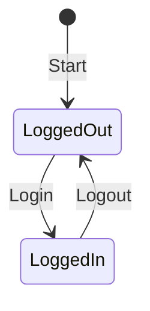

# 状態遷移テスト

## 概要
本ドキュメントでは、状態遷移 (State Transition) の考え方を学びつつ、`state_machine.py` を題材にテストコードの書き方やポイントを解説します。

## テスト対象のコード
```python
class UserSession:
    def __init__(self):
        self.state = "Logged Out"

    def login(self):
        if self.state == "Logged Out":
            self.state = "Logged In"
        else:
            raise ValueError("Cannot login from the current state")

    def logout(self):
        if self.state == "Logged In":
            self.state = "Logged Out"
        else:
            raise ValueError("Cannot logout from the current state")
```

## テストの考え方
状態遷移テストは、システムやモジュールがある状態から別の状態に遷移する過程を検証するテスト手法です。

## テストケースの設計
以下の状態遷移図に基づいてテストケースを設計します。



## テストコードの実装
```python
import pytest
from state_machine import UserSession

@pytest.mark.parametrize(
    "initial_state, action, expected_state",
    [
        ("Logged Out", "login", "Logged In"),
        ("Logged In", "logout", "Logged Out"),
    ]
)
def test_valid_transitions(initial_state, action, expected_state):
    session = UserSession()
    session.state = initial_state

    if action == "login":
        session.login()
    elif action == "logout":
        session.logout()

    assert session.state == expected_state

@pytest.mark.parametrize(
    "initial_state, action",
    [
        ("Logged In", "login"),
        ("Logged Out", "logout"),
    ]
)
def test_invalid_transitions(initial_state, action):
    session = UserSession()
    session.state = initial_state

    with pytest.raises(ValueError):
        if action == "login":
            session.login()
        elif action == "logout":
            session.logout()
```

## テストの実行方法
1. `state_machine.py` をプロジェクト直下に配置
2. `tests/test_state_machine.py` にテストコードを作成
3. 以下のコマンドでテストを実行
```bash
cd your_project_directory
pytest
```

## まとめ
- 状態遷移テストでは、状態遷移図を作成し、正常系と異常系の両方をテストします
- Pytestのパラメーター化を活用することで効率的にテストケースを実装できます
- 状態遷移が増えた場合もテストコードを拡張することでメンテナンス可能です
