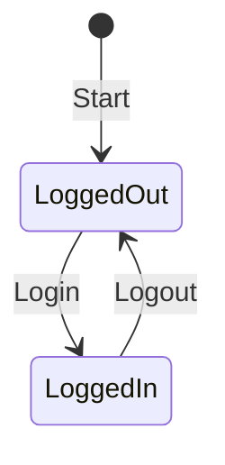

# 状態遷移テストの考え方と `state_machine.py` のテストコード作成ガイド

以下では、状態遷移 (State Transition) の考え方を学びつつ、`state_machine.py` を題材にテストコードの書き方やポイントを解説します。初心者が状態遷移テストを実践できるように、コード例や手順も含めて整理しています。

---

## 状態遷移テストとは？

状態遷移テストは、**システムやモジュールがある状態から別の状態に遷移する過程**を検証するテスト手法です。

### 状態遷移図とは？

以下のような図で、システムの「状態」と「状態を変化させるイベント」を表現します。

例: ユーザーセッションの状態遷移

この例では、以下を確認します。
1. 「ログアウト」状態から「ログイン」イベントを発生させる → 「ログイン済み」状態に遷移するか？  
2. 「ログイン済み」状態から「ログアウト」イベントを発生させる → 「ログアウト」状態に戻るか？  

---

## 1. 状態遷移の対象 (state_machine.py)

以下は簡単な状態遷移ロジックを持つサンプルコードです。

"""
class UserSession:
    def __init__(self):
        self.state = "Logged Out"

    def login(self):
        if self.state == "Logged Out":
            self.state = "Logged In"
        else:
            raise ValueError("Cannot login from the current state")

    def logout(self):
        if self.state == "Logged In":
            self.state = "Logged Out"
        else:
            raise ValueError("Cannot logout from the current state")
"""
---

## 2. 初学者が実際にテストコードを書くステップ

1. **状態遷移図を確認する**  
   - どの状態からどの状態に遷移するのかを明確にする。  
   - 「ログアウト状態 → ログインイベント → ログイン状態」など、期待する遷移を表に整理します。

2. **テストケースを設計する**  
   - 各遷移 (正常系) を確認するケース  
   - 不正な遷移 (異常系) を確認するケース  

3. **テストコード (`test_state_machine.py`) を書く**  
   - Pytest を用い、状態遷移の入力イベントと期待結果を比較します。  
   - パラメータ化して複数の遷移を効率的にテストします。  

4. **テストを実行する**  
   - コマンド: `pytest` を使用して実行  

---

## 3. 状態遷移のテストコード例

以下は `state_machine.py` をテストするコード例です。

"""
import pytest
from state_machine import UserSession

@pytest.mark.parametrize(
    "initial_state, action, expected_state",
    [
        # 正常系の遷移
        ("Logged Out", "login", "Logged In"),
        ("Logged In", "logout", "Logged Out"),
    ]
)
def test_valid_transitions(initial_state, action, expected_state):
    session = UserSession()
    session.state = initial_state

    # アクションを実行
    if action == "login":
        session.login()
    elif action == "logout":
        session.logout()

    # 期待する状態になっているか
    assert session.state == expected_state

@pytest.mark.parametrize(
    "initial_state, action",
    [
        # 異常系の遷移
        ("Logged In", "login"),    # ログイン中にログインは不可
        ("Logged Out", "logout"), # ログアウト中にログアウトは不可
    ]
)
def test_invalid_transitions(initial_state, action):
    session = UserSession()
    session.state = initial_state

    # アクションを実行してエラーを期待
    with pytest.raises(ValueError):
        if action == "login":
            session.login()
        elif action == "logout":
            session.logout()
"""
---

## 4. ポイント解説

1. **正常系の確認**  
   - `test_valid_transitions` では、状態遷移図に基づいた期待どおりの遷移を検証します。  

2. **異常系の確認**  
   - `test_invalid_transitions` では、不正な状態遷移を試みたときに適切な例外 (`ValueError`) が発生するかを確認します。  

3. **パラメータ化**  
   - Pytest の `@pytest.mark.parametrize` を用いることで、複数の遷移パターンを簡潔に記述できます。  

---

## 5. テスト実行方法

1. **ファイルを準備する**  
   - `state_machine.py` にサンプルコードをコピー  
   - `tests/test_state_machine.py` に上記のテストコードを作成  

2. **Pytest を実行する**  

cd your_project_directory pytest

3. **結果を確認する**  
- すべてのテストケースが `PASSED` になれば、状態遷移が正しく実装されていることが確認できます。  
- `FAILED` の場合、エラーメッセージを確認して修正します。

---

## 6. まとめ

- 状態遷移テストでは、状態遷移図を作成し、正常系と異常系の両方をテストします。  
- 初学者はまず「状態遷移図を作る → テストケースを設計する → コードに落とし込む」流れを意識してください。  
- Pytest のパラメータ化を活用することで、効率よく網羅的なテストが可能になります。  
